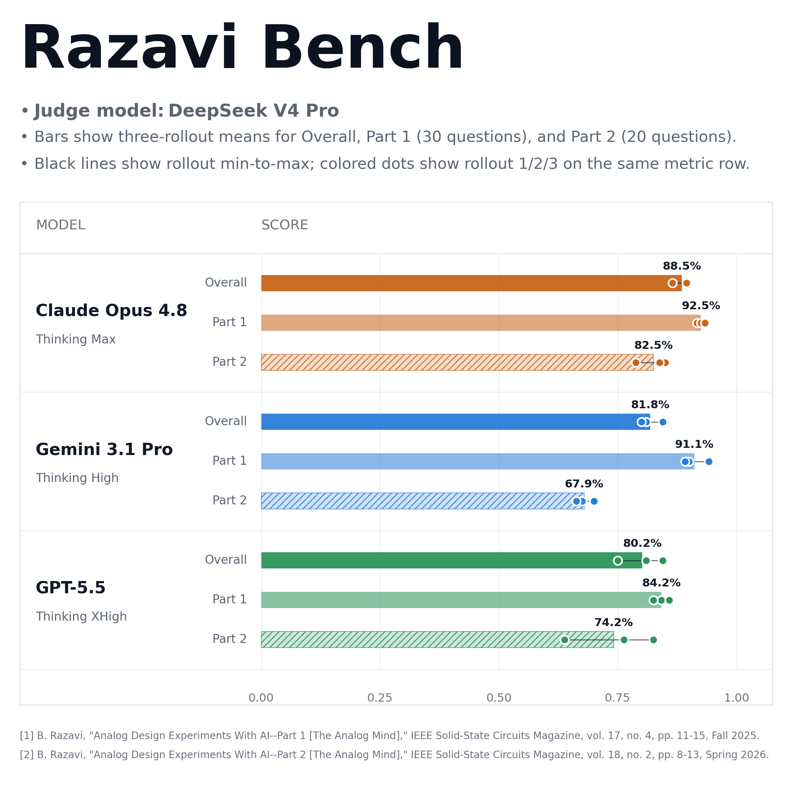

<h1 align="center">Razavi-bench</h1>

<p align="center">
  <strong>An expert-curated benchmark for analog-design reasoning.</strong>
</p>

<p align="center">
  
  
  
</p>

Razavi-bench packages the question-answer assessments from Behzad Razavi's
*Analog Design Experiments With AI* Part 1 and Part 2 into a clean
one-task-per-directory benchmark. The tasks probe whether a model can reason
about MOS devices, small-signal circuits, feedback, oscillators, comparators,
dividers, LNAs, TIAs, and LC oscillators.

Each task directory keeps only the benchmark prompt, figure, and curated golden
answer. Cleaned public AI model outputs are stored separately under
`experiments/` so the task definitions remain independent from any model run.

## At a Glance

| Item | Count / Status |
|---|---:|
| Total tasks | 50 |
| Part 1 | 30 questions, Q1-Q30 |
| Part 2 | 20 questions, Q1-Q20 |
| `task.toml` files | 0 |
| Source PDFs | Included under `docs/papers/` with permission |

## Repository Layout

```text
tasks/<part>-<number>-<semantic-slug>/
  instruction.md
  golden_solution.md
  figure-xx.png  # only when the question has a figure
```

Top-level files:

| Path | Purpose |
|---|---|
| `data/` | Hugging Face Dataset Viewer friendly JSONL exports |
| `evaluation_rubric.md` | 0-4 evaluation guide used by judge scripts |
| `experiments/` | Cleaned model outputs and per-experiment metadata |
| `tools/` | Current reusable evaluation utilities |
| `LICENSE` | License, source, and permission terms |

## Dataset Viewer Configs

This Hugging Face dataset exposes the benchmark task set as its structured
viewer config:

| Config | Rows | Description |
|---|---:|---|
| `tasks` | 50 | Benchmark prompts, golden solutions, part/question numbers, and local figure paths. |

Model rollout outputs and judge scores are kept under `experiments/` as
reproducibility artifacts, but they are not exposed as primary dataset configs.

## Task Format

Each `instruction.md` contains only the benchmark prompt and any local figure
reference. It intentionally excludes source metadata, original model answers,
scores, and explanatory commentary.

Each `golden_solution.md` contains the expected reasoning and final answer for
evaluation. The golden answers were reviewed against the source articles,
figures, and circuit analysis.

## Evaluation Tools

Use `tools/evaluate_answers.py` for new model-output scoring runs. It accepts an
answer JSONL, reads each task's `instruction.md` and `golden_solution.md`, reads
the repository-level `evaluation_rubric.md`, calls a configured judge API, and
writes score JSONL plus a metadata manifest.

The evaluator is intentionally separate from answer generation. Direct,
agentic, and simulator-assisted runs should first save final answers, then use
the same evaluator configuration for a comparable score pass.

## Experiments

`experiments/` contains cleaned model outputs and per-experiment metadata. The
`2026-06-26-direct-qa` experiment includes GPT, Gemini, and Claude
question-answer pairs from the direct-mm-v4-newgolden benchmark release. The
public files exclude system prompts, process
instructions, hidden reasoning, Vela session IDs, provider metadata, token/cost
data, and internal record IDs.

Automated judge scores, when present, are experiment metadata for transparency
and re-grading. They are not a substitute for independent expert review.
Historical experiment-specific scoring scripts live with the experiment that
produced the scores. New experiments should prefer the reusable evaluator in
`tools/` and store the generated judge metadata with the experiment outputs.

## License

Razavi-Bench uses mixed license terms. See `LICENSE` for the full terms.

The benchmark includes or adapts source questions and figures from Behzad
Razavi's *Analog Design Experiments With AI* articles with permission from
Behzad Razavi. Original article, question, and figure copyrights remain with
their respective rights holders, including Behzad Razavi and/or IEEE, as
applicable. This permission does not grant third parties the right to
redistribute, rehost, repackage, or incorporate the benchmark materials into
other benchmark or dataset releases.

Benchmark materials, including tasks, prompts, figures, source PDFs, golden
solutions, evaluation rubrics, judge prompts, model outputs, score tables,
metadata, derived datasets, dashboard-embedded benchmark data, and benchmark
documentation, are made available for public viewing, citation, non-commercial
research reference, and local evaluation from this repository only. They may not
be redistributed, sublicensed, mirrored, republished, used for model training or
fine-tuning, or incorporated into third-party benchmarks, datasets,
leaderboards, training sets, or evaluation suites without prior written
permission.

Software code in this repository is licensed under the Apache License, Version
2.0. The Apache License applies only to software code and not to benchmark
materials or third-party copyrighted content.

## Notes

The user request originally mentioned 40 questions for Part 1, but the available
Part 1 article contains Q1 through Q30. No synthetic questions were added.

## References

- B. Razavi, "Analog Design Experiments With AI—Part 1 [The Analog Mind]," in
  IEEE Solid-State Circuits Magazine, vol. 17, no. 4, pp. 11-15, Fall 2025.
- B. Razavi, "Analog Design Experiments With AI—Part 2 [The Analog Mind]," in
  IEEE Solid-State Circuits Magazine, vol. 18, no. 2, pp. 8-13, Spring 2026.

## Test Results From June 26, 2026

The `2026-06-26-direct-qa` experiment evaluates three answer models on all
50 Razavi-bench tasks. Each answer model has three rollouts, and each answer is
re-scored by two judge models: MiniMax M3 and DeepSeek V4 Pro.

| Answer Model | Judge Model | Overall | Part 1 First 30 | Part 2 Last 20 |
|---|---|---:|---:|---:|
| Claude | MiniMax-M3 | 88.50% | 94.72% | 79.17% |
| Claude | DeepSeek-V4-Pro | 90.33% | 95.00% | 83.33% |
| GPT | MiniMax-M3 | 81.17% | 88.33% | 70.42% |
| GPT | DeepSeek-V4-Pro | 81.83% | 86.67% | 74.58% |
| Gemini | MiniMax-M3 | 80.50% | 90.28% | 65.83% |
| Gemini | DeepSeek-V4-Pro | 83.00% | 92.78% | 68.33% |

<p align="center">
  
</p>

<p align="center">
  
</p>
