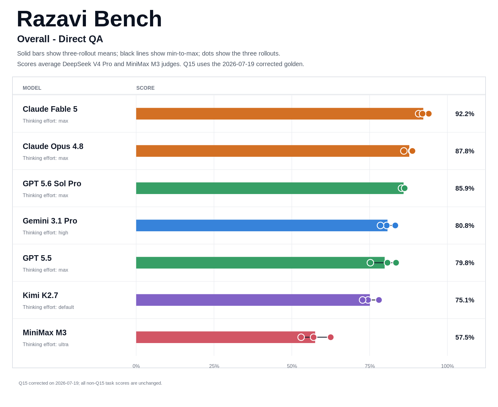
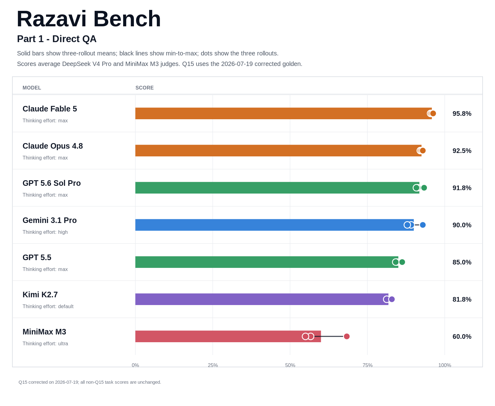
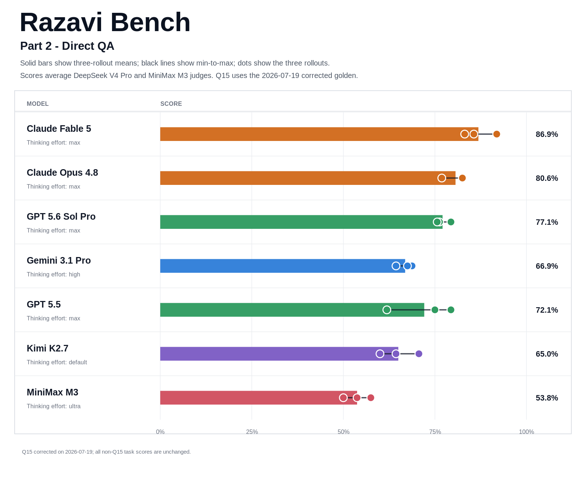
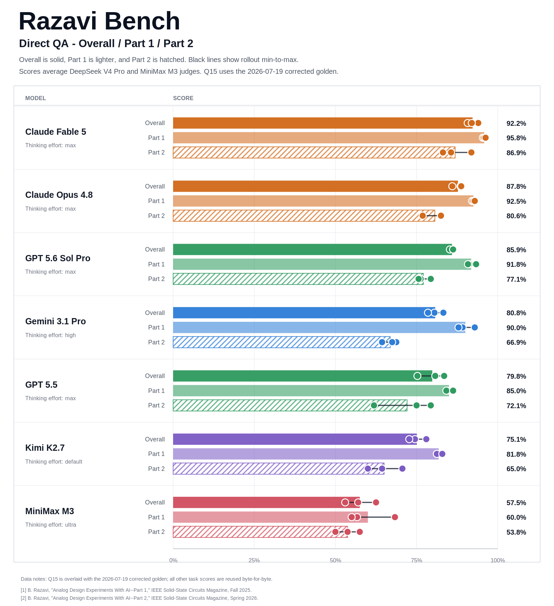

# Direct QA experiment - 2026-07-15

This directory contains the Direct QA evaluation run started on 2026-07-15
and completed on 2026-07-16. Each answer model was evaluated with three
rollouts over all 50 Razavi-Bench questions.

## Setup

- Mode: direct multimodal QA
- Rollouts: 3 per answer model
- Questions per rollout: 50
- Part 1: first 30 questions
- Part 2: last 20 questions
- Answer decoding: temperature 0 with model thinking enabled
- Judges: DeepSeek V4 Pro and MiniMax M3 no-thinking
- Final comparison score: arithmetic mean of the two judge scores
- Current aggregate: applies the
  [`2026-07-19-part1-q15-score-correction`](../2026-07-19-part1-q15-score-correction)
  overlay for Part 1 Q15; all non-Q15 task scores are unchanged.

Answer models in this experiment:

- Claude Fable 5 (`claude-fable-5[1m][proxy+direct]`)
- GPT 5.6 Sol Pro (`gpt-5.6-sol-pro-thinking-max[direct]`)

## Aggregate results

Scores below are weighted over all three rollouts.

| Answer model | Judge | Part 1 | Part 2 | Overall |
|---|---|---:|---:|---:|
| Claude Fable 5 | DeepSeek V4 Pro | 96.67% | 87.92% | 93.17% |
| Claude Fable 5 | MiniMax M3 no-thinking | 95.00% | 85.83% | 91.33% |
| Claude Fable 5 | Mean | 95.83% | 86.88% | 92.25% |
| GPT 5.6 Sol Pro | DeepSeek V4 Pro | 91.67% | 77.92% | 86.17% |
| GPT 5.6 Sol Pro | MiniMax M3 no-thinking | 91.94% | 76.25% | 85.67% |
| GPT 5.6 Sol Pro | Mean | 91.81% | 77.08% | 85.92% |

## Contents

- `model_outputs/`: sanitized model answers, one JSONL file per rollout
- `judge_outputs/`: final per-question judge results and run metadata
- `judge_scores/`: rollout-level and aggregate score tables
- `figures/`: combined Direct QA comparisons, including prior published runs

The judge output records include prompt, answer, rubric, evaluator, and script
hashes. Intermediate retry artifacts and platform-specific task metadata are
kept outside the public repository.

## Figures

## Evaluation

The final judge outputs were produced with the reusable evaluator at
[`../../tools/evaluate_answers.py`](../../tools/evaluate_answers.py). Exact
judge parameters and content hashes are stored next to each score JSONL file
in its `.metadata.json` sidecar.
