# Direct QA experiment - 2026-07-18

This directory contains the Kimi K3 Direct QA evaluation run completed on
2026-07-18. The model was evaluated with three rollouts over all 50
Razavi-Bench questions, for 150 final answers in total.

## Setup

- Mode: direct multimodal QA
- Answer model: Kimi K3 (`kimi-for-coding`, evaluation model ID `209566`)
- Rollouts: 3
- Questions per rollout: 50
- Part 1: first 30 questions
- Part 2: last 20 questions
- Figure-bearing questions: 46 per rollout, 138 total
- Temperature: 1, as required by the model endpoint
- Maximum output tokens: 65,536
- Judges: DeepSeek V4 Pro and MiniMax M3 no-thinking
- Judge temperature: 0
- Judge maximum output tokens: 2,048
- Final comparison score: arithmetic mean of the two judge scores

The initial generation encountered provider quota errors and several stalled
or gateway-timed-out requests. Only records with a non-empty visible answer
were retained. Missing rollout slots were retried with the same question,
figure, model, and decoding configuration until all three rollouts contained
50 answers.

## Contents

- `model_outputs/kimi-k3-209566-rollout-1.jsonl`
- `model_outputs/kimi-k3-209566-rollout-2.jsonl`
- `model_outputs/kimi-k3-209566-rollout-3.jsonl`
- `judge_outputs/`: per-question DeepSeek and MiniMax scores and rationales
- `judge_scores/summary.csv`: per-judge rollout and aggregate summaries
- `judge_scores/aggregate.csv`: per-judge and two-judge mean scores
- `judge_scores/comparison.csv`: historical cross-model comparison sorted by Overall
- `figures/`: three comparison views, each with Overall, Part 1, Part 2, and combined charts

Each JSONL line contains the effective benchmark question, final visible
answer, figure paths, rollout number, model name, and model-call attempt count.
The files exclude hidden reasoning, API keys, platform session IDs, internal
task IDs, provider response metadata, and token or cost records.

Intermediate empty responses and retry artifacts are not included. When a
rollout slot required a retry, the corresponding JSONL line contains its final
successful answer while preserving the original rollout assignment and task
order.

## Aggregate results

Scores below are weighted over all three rollouts.

| Judge | Part 1 | Part 2 | Overall |
|---|---:|---:|---:|
| DeepSeek V4 Pro | 86.67% | 66.25% | 78.50% |
| MiniMax M3 no-thinking | 85.83% | 65.83% | 77.83% |
| Mean | 86.25% | 66.04% | 78.17% |

## Rollout results

The table reports the arithmetic mean of the DeepSeek and MiniMax scores for
each rollout.

| Rollout | Part 1 | Part 2 | Overall |
|---|---:|---:|---:|
| 1 | 86.25% | 64.38% | 77.50% |
| 2 | 84.58% | 70.00% | 78.75% |
| 3 | 87.92% | 63.75% | 78.25% |

## Cross-model comparison

The table uses the arithmetic mean of the DeepSeek V4 Pro and MiniMax M3
no-thinking judge scores. Every row is the mean of three rollouts. Models are
sorted by Overall; Part 1 and Part 2 charts retain this same order.

| Rank | Model | Thinking effort | Part 1 | Part 2 | Overall |
|---:|---|---|---:|---:|---:|
| 1 | Claude Fable 5 | max | 98.89% | 86.88% | 94.08% |
| 2 | Claude Opus 4.8 | max | 94.86% | 80.62% | 89.17% |
| 3 | GPT 5.6 Sol Pro | max | 94.86% | 77.08% | 87.75% |
| 4 | Gemini 3.1 Pro | high | 91.53% | 66.88% | 81.67% |
| 5 | GPT 5.5 | max | 87.50% | 72.08% | 81.33% |
| 6 | Kimi K3 | max | 86.25% | 66.04% | 78.17% |
| 7 | Kimi K2.7 | default | 82.92% | 65.00% | 75.75% |
| 8 | MiniMax M3 | ultra | 60.42% | 53.75% | 57.75% |

## Figures

### Core models

**Figure 1. Overall**

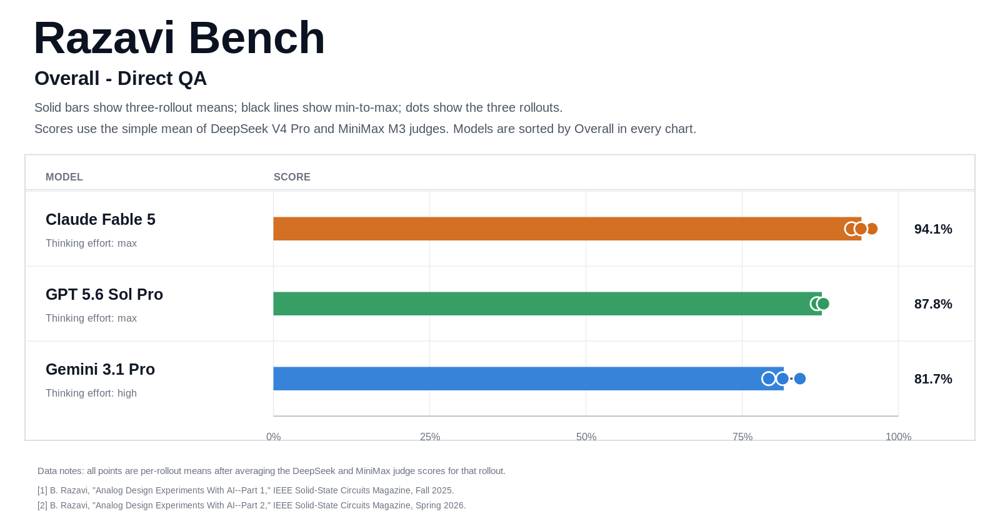

**Figure 2. Part 1**

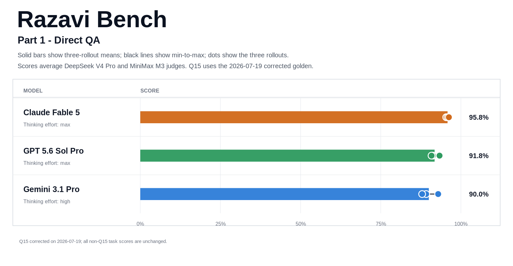

**Figure 3. Part 2**

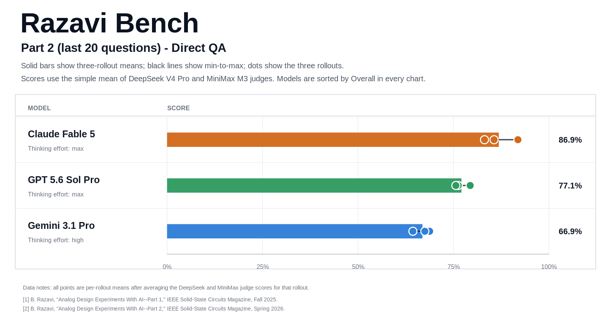

**Figure 4. Overall, Part 1, and Part 2**

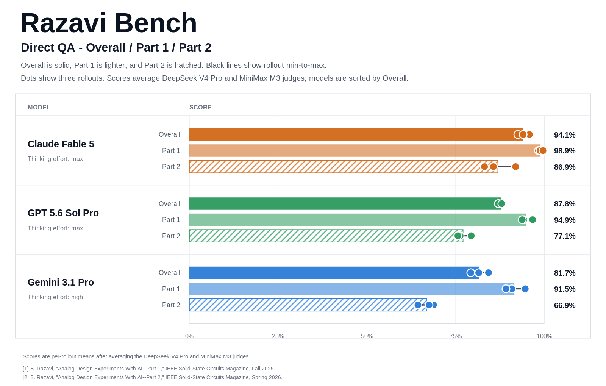

### Core models and Kimi K3

**Figure 5. Overall**

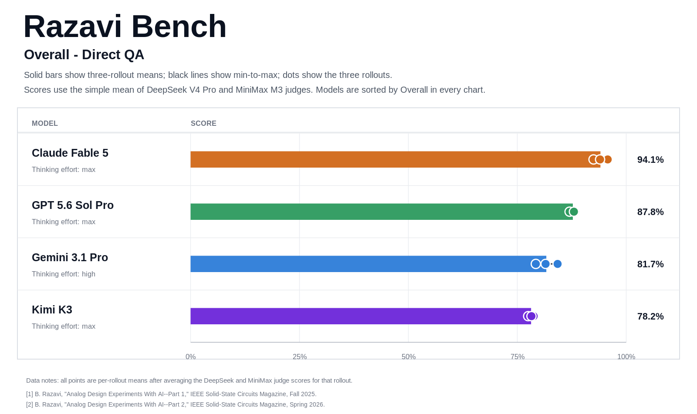

**Figure 6. Part 1**

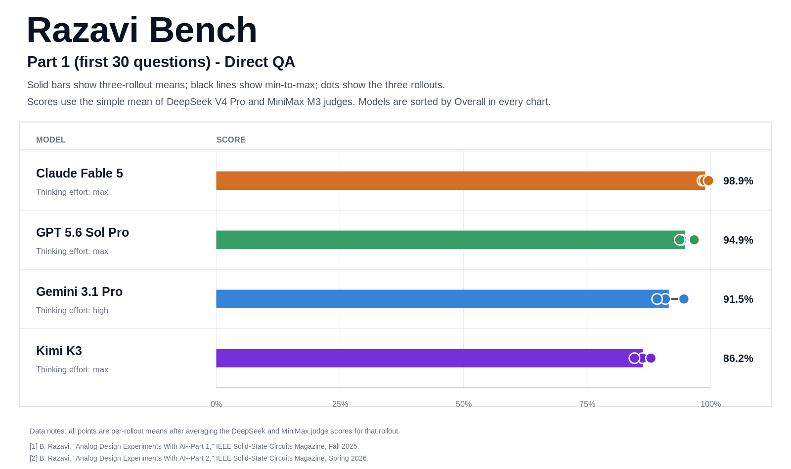

**Figure 7. Part 2**

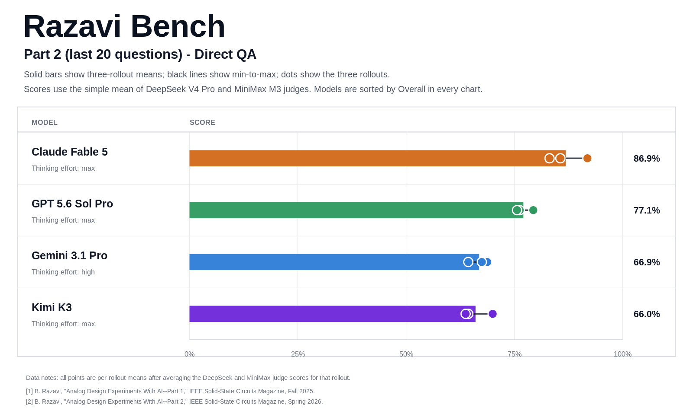

**Figure 8. Overall, Part 1, and Part 2**

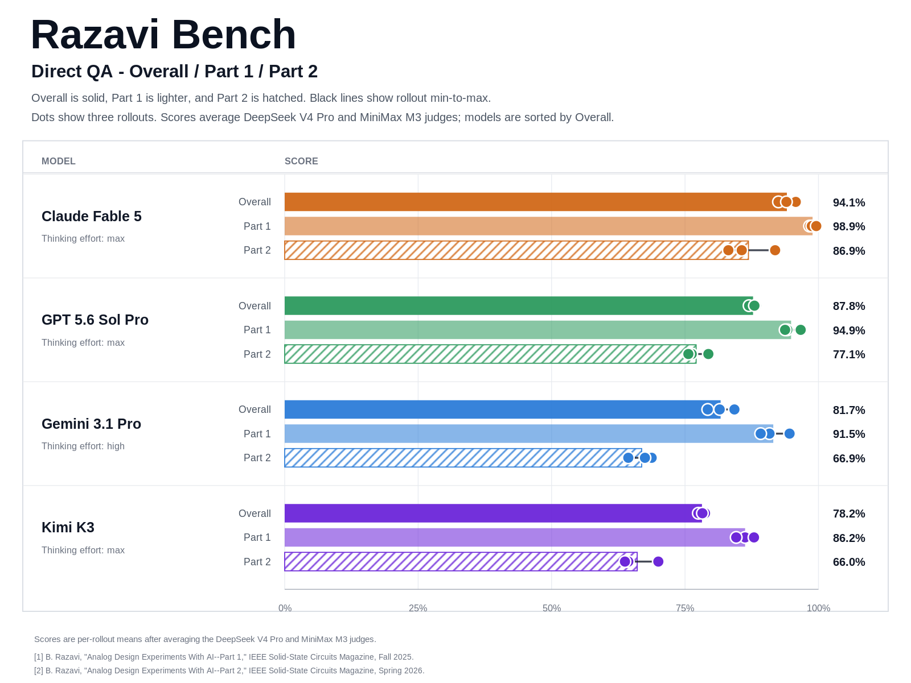

### All evaluated models

**Figure 9. Overall**

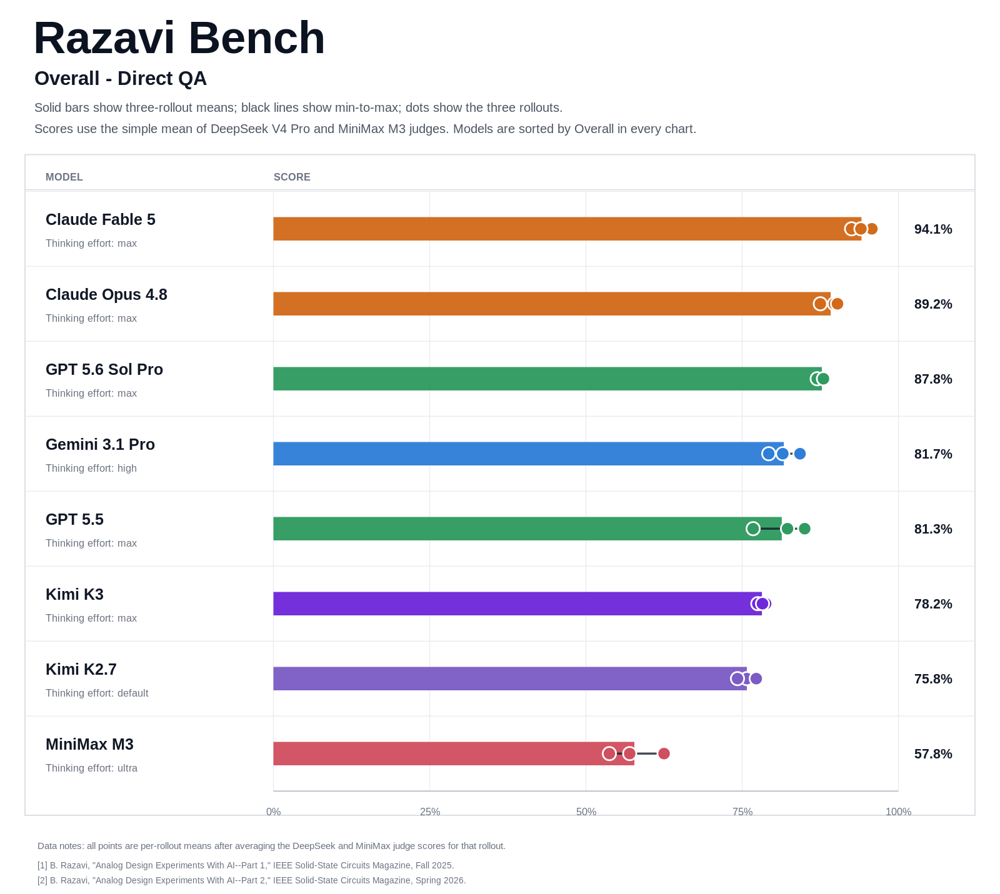

**Figure 10. Part 1**

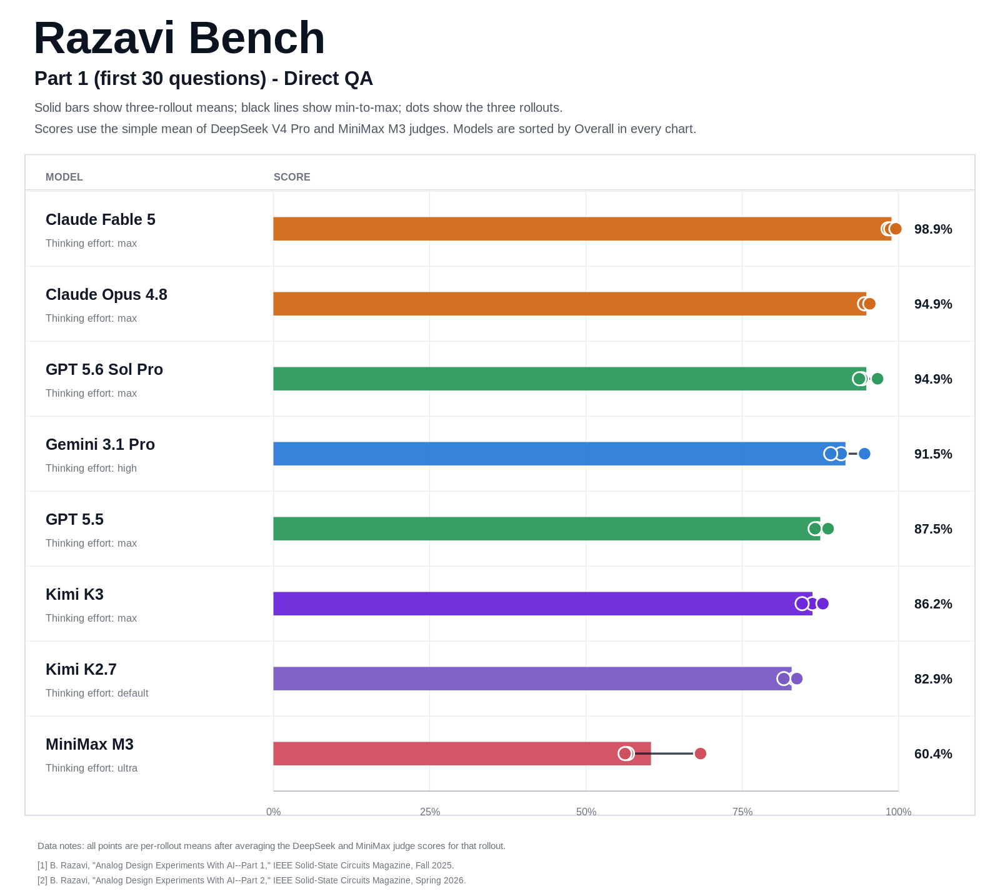

**Figure 11. Part 2**

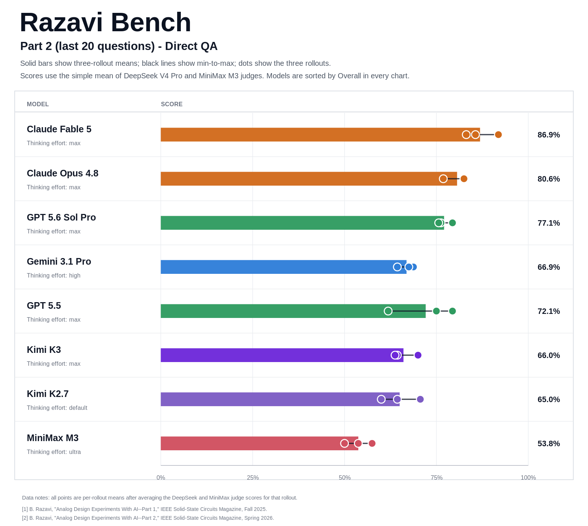

**Figure 12. Overall, Part 1, and Part 2**

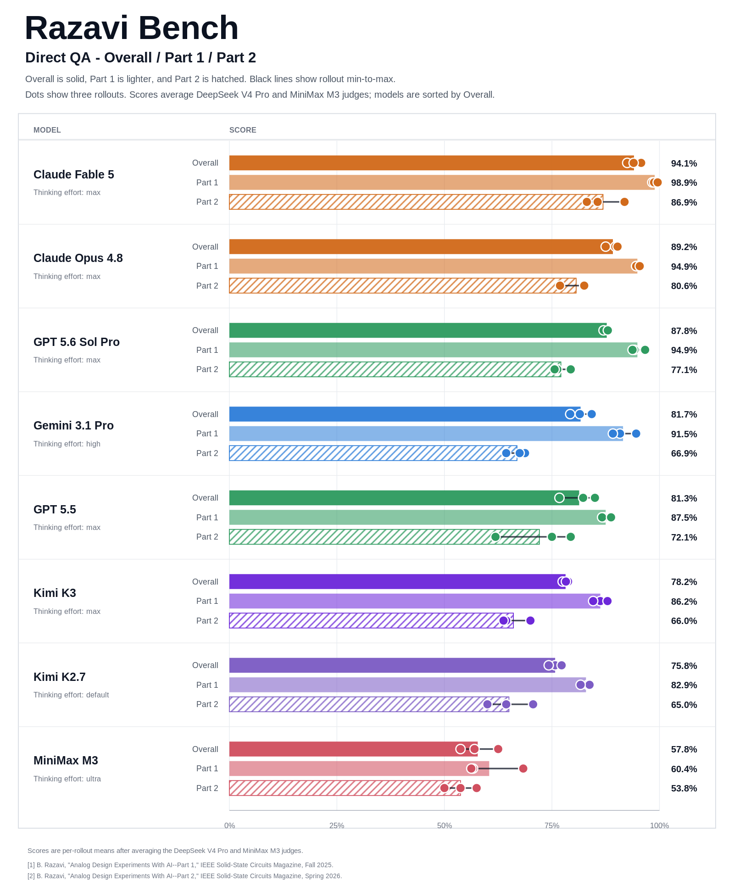

**Figure 13. Overall, Part 1, and Part 2 without MiniMax M3**

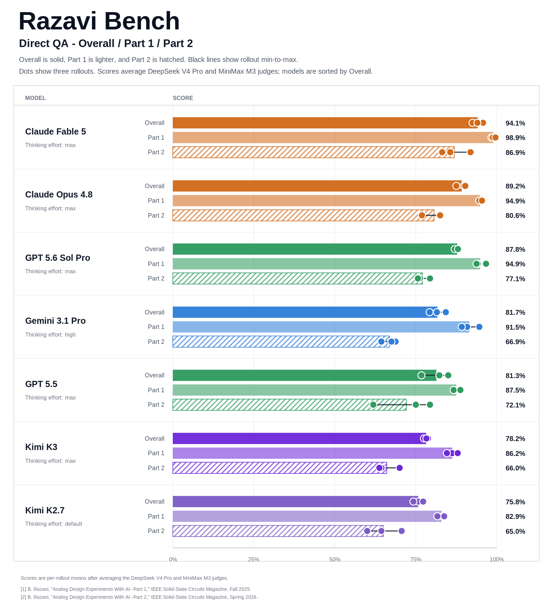

## Evaluation

The judge outputs were produced with the repository-level evaluator at
[`../../tools/evaluate_answers.py`](../../tools/evaluate_answers.py). Exact
judge parameters and content hashes are stored next to each score JSONL file
in its `.metadata.json` sidecar. Transient empty judge responses were retried
with the same prompt and decoding parameters; final score files retain exactly
one successful judgment per answer.
