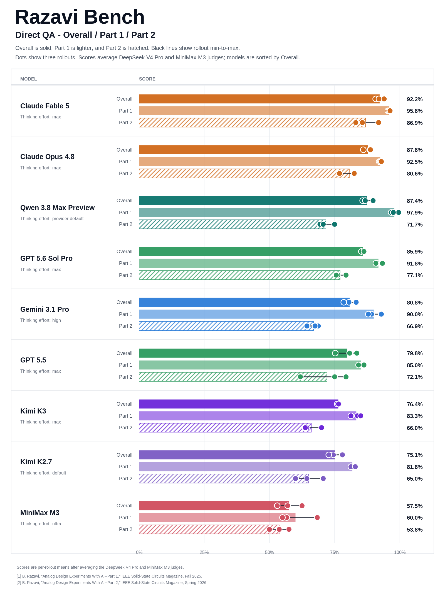
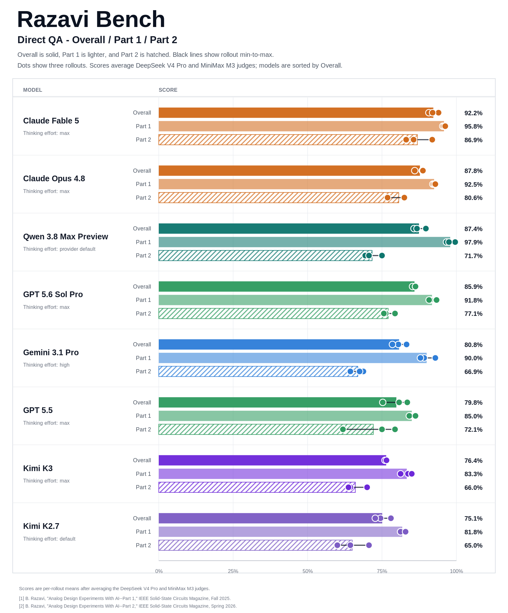

# Direct QA experiment - 2026-07-20

This directory contains the Qwen 3.8 Max Preview Direct QA evaluation run
completed on 2026-07-20. The model was evaluated with three rollouts over all
50 Razavi-Bench questions, for 150 final answers in total.

## Setup

- Mode: direct multimodal QA
- Answer model: Qwen 3.8 Max Preview (`qwen3.8-max-preview`)
- Rollouts: 3
- Questions per rollout: 50
- Part 1: first 30 questions
- Part 2: last 20 questions
- Figure-bearing questions: 46 per rollout, 138 total
- Temperature: 0
- Maximum output tokens: 65,536
- Generation concurrency: 20
- Judges: DeepSeek V4 Pro and MiniMax M3 no-thinking
- Judge temperature: 0
- Primary judge maximum output tokens: 2,048
- Final comparison score: arithmetic mean of the two judge scores
- Q15 scoring: current hard rule from the 2026-07-19 correction

All 150 answer slots contain a non-empty visible answer. One empty provider
response was retried with the same question, figure, model, and decoding
configuration. For all 138 figure-bearing requests, provider usage metadata
reported image-input tokens.

## Contents

- `model_outputs/`: three cleaned 50-answer rollout JSONL files
- `judge_outputs/`: per-question DeepSeek and MiniMax scores and rationales
- `judge_scores/qwen-3.8-max-preview-summary.csv`: rollout and aggregate scores
- `judge_scores/qwen-3.8-max-preview-summary.json`: machine-readable summary
- `judge_scores/comparison.csv`: current cross-model comparison
- `figures/`: public all-model comparison figures

The public files exclude API keys, full provider responses, hidden reasoning,
token usage, internal request metadata, private endpoints, and local filesystem
paths. Full provider responses remain outside the public repository.

## Aggregate results

Scores below are weighted over all three rollouts.

| Judge | Part 1 | Part 2 | Overall |
|---|---:|---:|---:|
| DeepSeek V4 Pro | 98.33% | 72.92% | 88.17% |
| MiniMax M3 no-thinking | 97.50% | 70.42% | 86.67% |
| Mean | 97.92% | 71.67% | 87.42% |

## Rollout results

The table reports the arithmetic mean of the DeepSeek and MiniMax scores for
each rollout.

| Rollout | Part 1 | Part 2 | Overall |
|---|---:|---:|---:|
| 1 | 99.58% | 75.00% | 89.75% |
| 2 | 96.67% | 69.38% | 85.75% |
| 3 | 97.50% | 70.62% | 86.75% |

Part 1 is near ceiling, while Part 2 remains materially weaker. The resulting
87.42% Overall score places this run third in the current active Direct QA
comparison. Q15 was answered correctly in all three rollouts: each answer
identified both devices as NMOS, described the upper source follower and lower
common-source pull-down, and rejected the circuit as a normal CMOS inverter.
Both judges awarded 4/4 to all three Q15 answers.

## Leakage check and limitations

The generation runner sent only each task's prompt text and PNG figures. It did
not send golden solutions or scoring rules. A text audit found no occurrences
of the benchmark's scoring-gate terminology in the 150 answers, and no evidence
of copied golden-solution paragraphs. However, the repository and some source
articles are public, so this experiment cannot rule out pretraining exposure.
The result should therefore be treated as a measured model score, not proof
that benchmark contamination is impossible.

## Figures

### All evaluated models

### All evaluated models except MiniMax M3

The MiniMax M3 answer model is omitted from this view; MiniMax M3 remains one
of the two judges used in every displayed score.

## Reproduction

The answers were collected with [`../../tools/run_direct_qa.py`](../../tools/run_direct_qa.py)
and scored with [`../../tools/evaluate_answers.py`](../../tools/evaluate_answers.py).
Exact content and rubric hashes are stored with the judge outputs. Transient
judge parse failures were retried; the final score files contain exactly one
successful judgment per answer.
