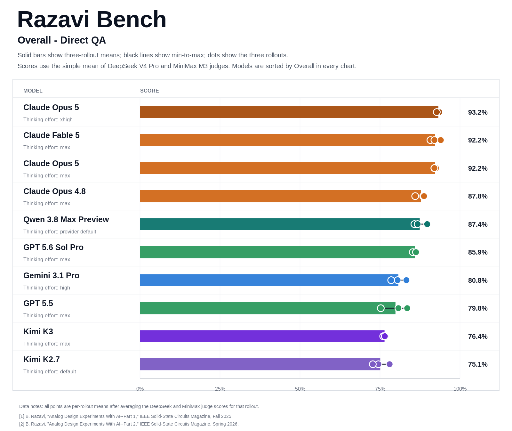

# Direct QA experiment - 2026-07-25

This directory contains two Claude Opus 5 Direct QA configurations evaluated
on 2026-07-25. Each configuration used three rollouts over all 50
Razavi-Bench questions, for 300 final answers in total.

## Setup

- Mode: direct multimodal QA
- Answer model: Claude Opus 5 (`claude-opus-5`), Vela model ID `209903`,
  thinking effort max
- Answer model: Claude Opus 5 (`claude-opus-5[1m]`), Vela model ID `209900`,
  thinking effort xhigh
- Rollouts: 3 per configuration
- Questions per rollout: 50
- Part 1: first 30 questions
- Part 2: last 20 questions
- Figure-bearing questions: 46 per rollout, 276 total
- Generation concurrency: 100
- Judges: DeepSeek V4 Pro and MiniMax M3 no-thinking
- Judge temperature: 0
- Primary judge maximum output tokens: 2,048
- Final comparison score: arithmetic mean of the two judge scores
- Q15 scoring: current hard rule from the 2026-07-19 correction

All 300 answer slots contain a non-empty visible answer, with 50 unique tasks
in each rollout and no missing or duplicated slots. Six records in the max
configuration remained in an anomalous platform state despite having complete
model responses; their final visible answers were recovered from model logs.
The xhigh configuration required targeted retries for one slow answer slot.
The answer traces showed no tool or web use.

## Contents

- `model_outputs/`: six cleaned 50-answer rollout JSONL files
- `judge_outputs/`: per-question DeepSeek and MiniMax scores and rationales
- `judge_scores/claude-opus-5-209903-summary.csv`: rollout and aggregate scores
- `judge_scores/claude-opus-5-thinking-xhigh-209900-summary.csv`: xhigh scores
- `judge_scores/claude-opus-5-209903-summary.json`: machine-readable summary
- `judge_scores/claude-opus-5-thinking-xhigh-209900-summary.json`: xhigh summary
- `judge_scores/comparison.csv`: current cross-model comparison
- `figures/`: public all-model comparison figures

The public files exclude API keys, full provider responses, hidden reasoning,
token usage, internal request metadata, private endpoints, and local filesystem
paths. Full provider responses remain outside the public repository.

## Aggregate results

Scores below are weighted over all three rollouts for each configuration.

| Configuration | Judge | Part 1 | Part 2 | Overall |
|---|---|---:|---:|---:|
| xhigh | DeepSeek V4 Pro | 95.28% | 92.08% | 94.00% |
| xhigh | MiniMax M3 no-thinking | 95.56% | 87.92% | 92.50% |
| xhigh | Mean | 95.42% | 90.00% | 93.25% |
| max | DeepSeek V4 Pro | 94.72% | 89.17% | 92.50% |
| max | MiniMax M3 no-thinking | 95.28% | 86.67% | 91.83% |
| max | Mean | 95.00% | 87.92% | 92.17% |

## Rollout results

The tables report the arithmetic mean of the DeepSeek and MiniMax scores for
each rollout.

| xhigh rollout | Part 1 | Part 2 | Overall |
|---|---:|---:|---:|
| 1 | 95.42% | 90.63% | 93.50% |
| 2 | 96.67% | 88.75% | 93.50% |
| 3 | 94.17% | 90.63% | 92.75% |

| max rollout | Part 1 | Part 2 | Overall |
|---|---:|---:|---:|
| 1 | 92.92% | 90.63% | 92.00% |
| 2 | 95.83% | 87.50% | 92.50% |
| 3 | 96.25% | 85.63% | 92.00% |

The xhigh configuration reaches 93.25% Overall and ranks first in the current
active Direct QA comparison. It exceeds the max configuration by 1.08 points
Overall and 2.08 points on Part 2. The two xhigh judges differ by 1.50 points
Overall, while its three rollout scores remain tightly grouped at 93.50%,
93.50%, and 92.75%.

## Figures

### Overall only

### Overall only, excluding MiniMax

The MiniMax M3 answer model is omitted from this view; MiniMax M3 remains one
of the two judges used in every displayed score.

### All evaluated models

### All evaluated models except MiniMax M3

The MiniMax M3 answer model is omitted from this view; MiniMax M3 remains one
of the two judges used in every displayed score.

## Reproduction

The answers were collected with [`../../tools/run_direct_qa.py`](../../tools/run_direct_qa.py)
and scored with [`../../tools/evaluate_answers.py`](../../tools/evaluate_answers.py).
Exact content and rubric hashes are stored with the judge outputs. Transient
judge parse failures were retried; every final score file contains exactly one
successful judgment per answer.
