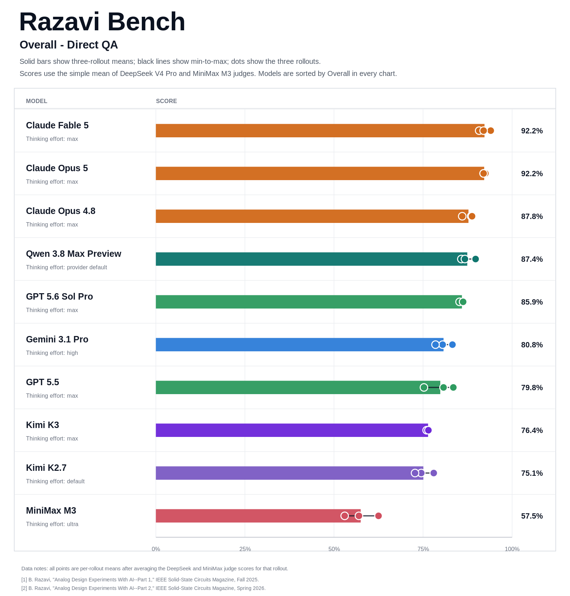
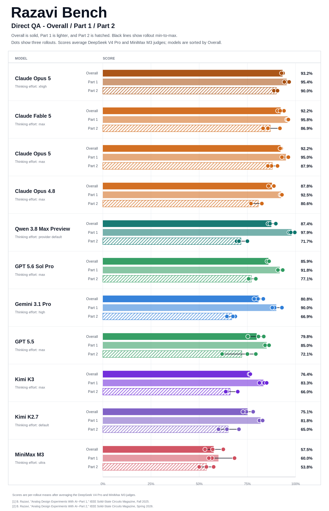
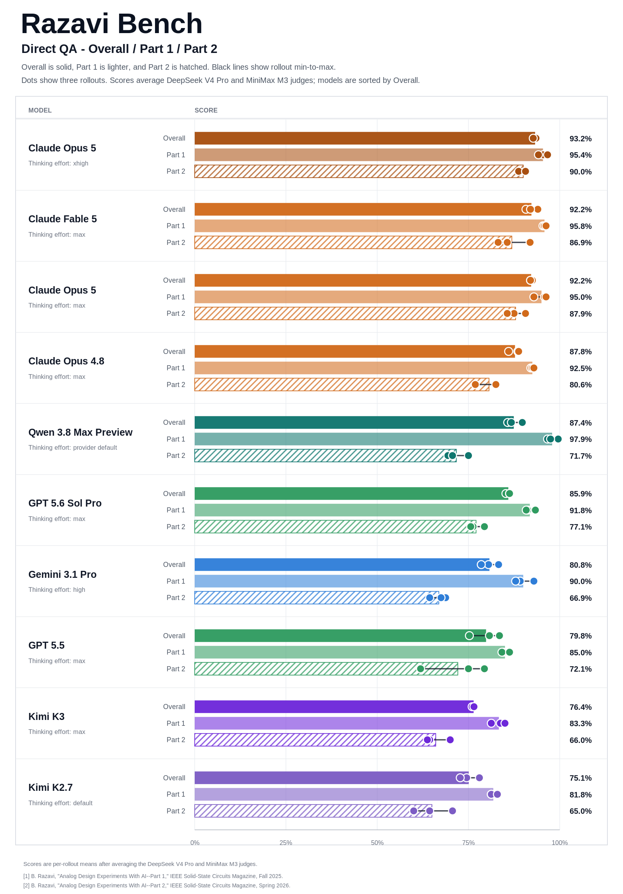

# Direct QA experiment - 2026-07-25

This directory contains the Claude Opus 5 Direct QA evaluation run completed
on 2026-07-25. The model was evaluated with three rollouts over all 50
Razavi-Bench questions, for 150 final answers in total.

## Setup

- Mode: direct multimodal QA
- Answer model: Claude Opus 5 (`claude-opus-5`)
- Vela model ID: `209903`
- Thinking effort: max
- Rollouts: 3
- Questions per rollout: 50
- Part 1: first 30 questions
- Part 2: last 20 questions
- Figure-bearing questions: 46 per rollout, 138 total
- Generation concurrency: 100
- Judges: DeepSeek V4 Pro and MiniMax M3 no-thinking
- Judge temperature: 0
- Primary judge maximum output tokens: 2,048
- Final comparison score: arithmetic mean of the two judge scores
- Q15 scoring: current hard rule from the 2026-07-19 correction

All 150 answer slots contain a non-empty visible answer, with 50 unique tasks
in each rollout and no missing or duplicated slots. Six Vela records remained
in an anomalous platform state despite having complete model responses; their
final visible answers were recovered from the corresponding model logs. No
model reruns were needed, and the answer traces showed no tool or web use.

## Contents

- `model_outputs/`: three cleaned 50-answer rollout JSONL files
- `judge_outputs/`: per-question DeepSeek and MiniMax scores and rationales
- `judge_scores/claude-opus-5-209903-summary.csv`: rollout and aggregate scores
- `judge_scores/claude-opus-5-209903-summary.json`: machine-readable summary
- `judge_scores/comparison.csv`: current cross-model comparison
- `figures/`: public all-model comparison figures

The public files exclude API keys, full provider responses, hidden reasoning,
token usage, internal request metadata, private endpoints, and local filesystem
paths. Full provider responses remain outside the public repository.

## Aggregate results

Scores below are weighted over all three rollouts.

| Judge | Part 1 | Part 2 | Overall |
|---|---:|---:|---:|
| DeepSeek V4 Pro | 94.72% | 89.17% | 92.50% |
| MiniMax M3 no-thinking | 95.28% | 86.67% | 91.83% |
| Mean | 95.00% | 87.92% | 92.17% |

## Rollout results

The table reports the arithmetic mean of the DeepSeek and MiniMax scores for
each rollout.

| Rollout | Part 1 | Part 2 | Overall |
|---|---:|---:|---:|
| 1 | 92.92% | 90.63% | 92.00% |
| 2 | 95.83% | 87.50% | 92.50% |
| 3 | 96.25% | 85.63% | 92.00% |

Claude Opus 5 reaches 92.17% Overall, placing second in the current active
Direct QA comparison and trailing Claude Fable 5 by 0.08 percentage points.
Its 87.92% Part 2 score is slightly higher than Claude Fable 5's 86.88%.
The two judges differ by only 0.67 points Overall, while the rollout Overall
scores remain tightly grouped at 92.0%, 92.5%, and 92.0%.

## Figures

### Overall only

### All evaluated models

### All evaluated models except MiniMax M3

The MiniMax M3 answer model is omitted from this view; MiniMax M3 remains one
of the two judges used in every displayed score.

## Reproduction

The answers were collected with [`../../tools/run_direct_qa.py`](../../tools/run_direct_qa.py)
and scored with [`../../tools/evaluate_answers.py`](../../tools/evaluate_answers.py).
Exact content and rubric hashes are stored with the judge outputs. Transient
judge parse failures were retried; the final score files contain exactly one
successful judgment per answer.
