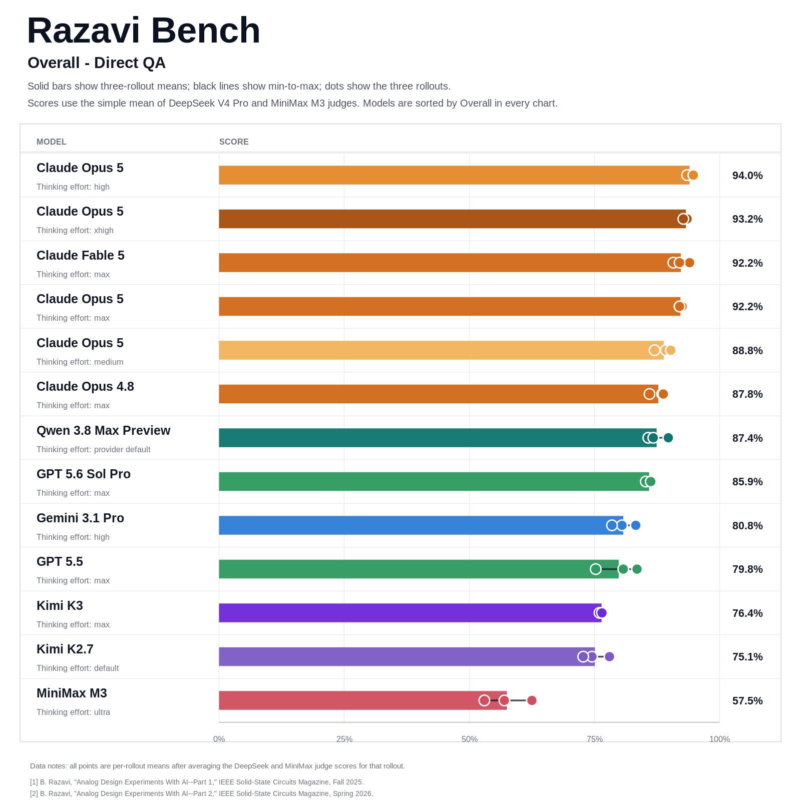
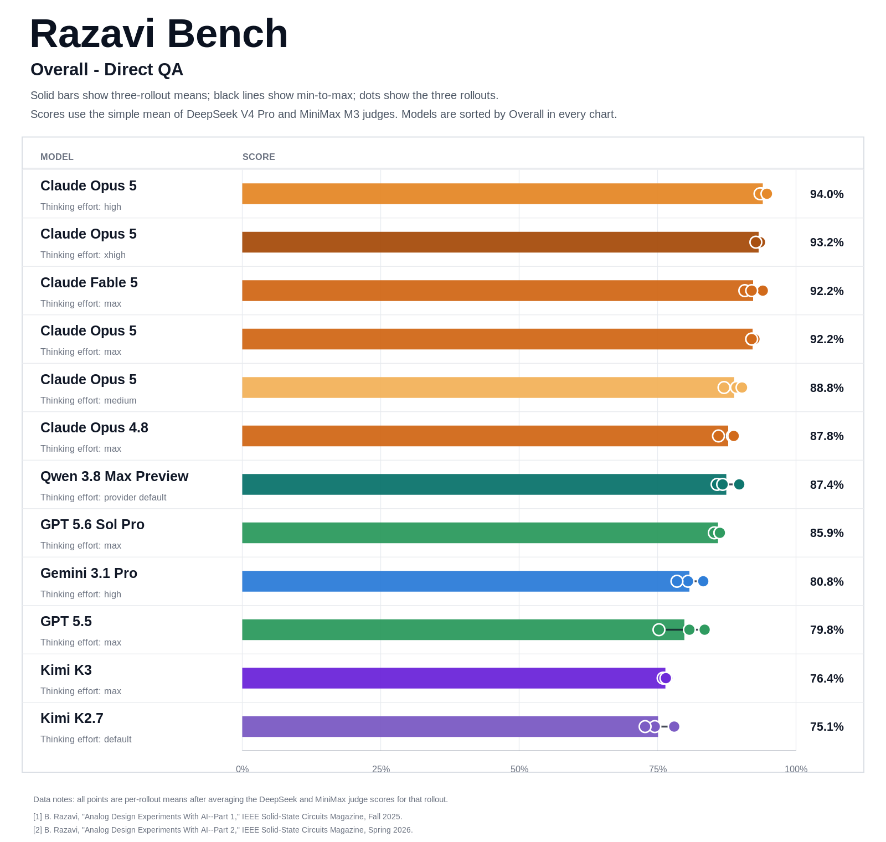
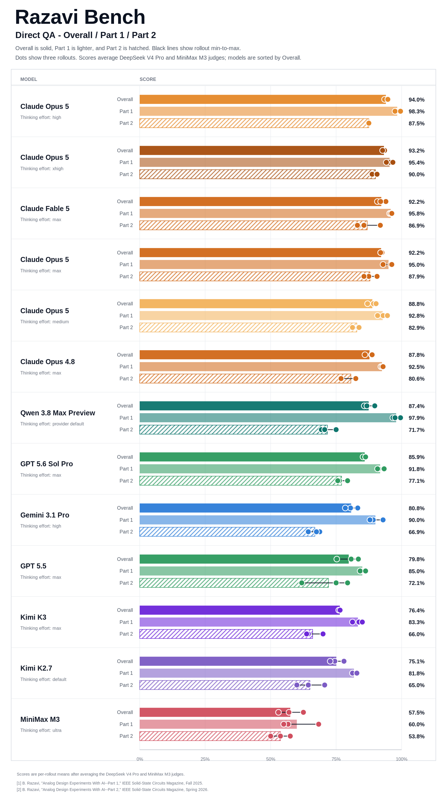
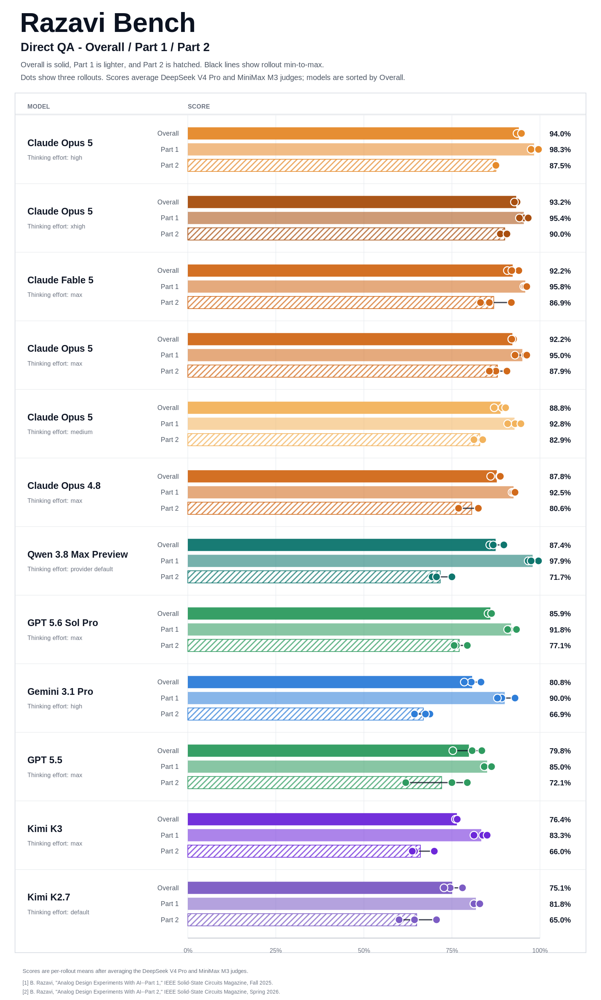

# Direct QA experiment - 2026-07-26

This directory contains one Claude Opus 5 Direct QA configuration evaluated on
2026-07-26. It used three rollouts over all 50 Razavi-Bench questions, for 150
final answers in total.

## Setup

- Mode: direct multimodal QA
- Answer model: Claude Opus 5 (`claude-opus-5[1m]`), Vela model ID `209905`,
  thinking effort medium
- Direct process snippet: `9658` version 3
- Rollouts: 3
- Questions per rollout: 50
- Part 1: first 30 questions
- Part 2: last 20 questions
- Figure-bearing questions: 46 per rollout, 138 total
- Generation concurrency: 100
- Judges: DeepSeek V4 Pro and MiniMax M3 no-thinking
- Judge temperature: 0
- Primary judge maximum output tokens: 2,048
- Final comparison score: arithmetic mean of the two judge scores
- Q15 scoring: current hard rule from the 2026-07-19 correction

All 150 answer slots contain a non-empty visible answer, with 50 unique tasks
in each rollout and no missing or duplicated slots. Every figure-bearing answer
was verified to include an image in the model request. The smoke answer for
Part 1 Q6 authentically misread the diode-connected PMOS as a grounded/off
NMOS; it was retained. One R3 record was initially delayed with no model log,
then completed with a valid answer. A targeted retry also completed but was
excluded from the formal R3 output because the original record had become
valid. The answer traces showed no tool or web use.

## Contents

- `model_outputs/`: three cleaned 50-answer rollout JSONL files
- `judge_outputs/`: per-question DeepSeek and MiniMax scores and rationales
- `judge_scores/claude-opus-5-thinking-medium-209905-summary.csv`: rollout and aggregate scores
- `judge_scores/claude-opus-5-thinking-medium-209905-summary.json`: machine-readable summary
- `judge_scores/comparison.csv`: current cross-model comparison
- `figures/`: public all-model comparison figures

The public files exclude API keys, full provider responses, hidden reasoning,
token usage, internal request metadata, private endpoints, and local
filesystem paths. Full provider responses remain outside the public repository.

## Aggregate results

| Judge | Part 1 | Part 2 | Overall |
|---|---:|---:|---:|
| DeepSeek V4 Pro | 92.50% | 82.92% | 88.67% |
| MiniMax M3 no-thinking | 93.06% | 82.92% | 89.00% |
| Mean | 92.78% | 82.92% | 88.83% |

## Rollout results

| Rollout | Part 1 | Part 2 | Overall |
|---|---:|---:|---:|
| 1 | 92.92% | 83.75% | 89.25% |
| 2 | 90.83% | 81.25% | 87.00% |
| 3 | 94.58% | 83.75% | 90.25% |

The medium configuration reaches 88.83% Overall and ranks fifth in the active
Direct QA comparison. Part 1 is 5.28 points higher than Part 2. The two judge
scores differ by only 0.33 points Overall, and the three rollout means range
from 87.00% to 90.25%.

## Figures

### Overall only

### Overall only, excluding MiniMax

The MiniMax M3 answer model is omitted from this view; MiniMax M3 remains one
of the two judges used in every displayed score.

### All evaluated models

### All evaluated models except MiniMax M3

The MiniMax M3 answer model is omitted from this view; MiniMax M3 remains one
of the two judges used in every displayed score.

## Reproduction

The answers were collected with [`../../tools/run_direct_qa.py`](../../tools/run_direct_qa.py)
and scored with [`../../tools/evaluate_answers.py`](../../tools/evaluate_answers.py).
Exact content and rubric hashes are stored with the judge outputs. Transient
judge parse failures were retried; every final score file contains exactly one
successful judgment per answer.
